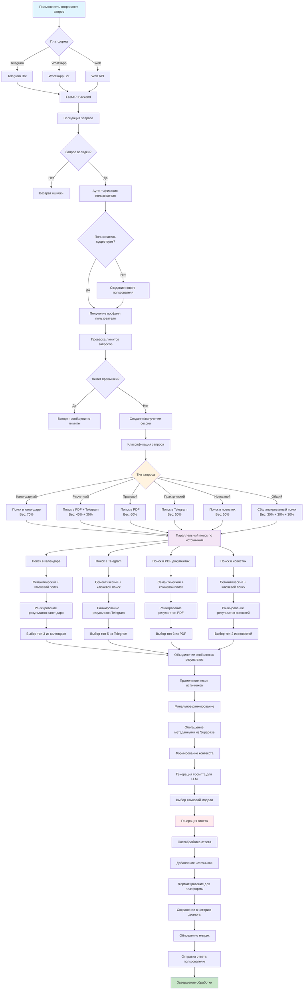
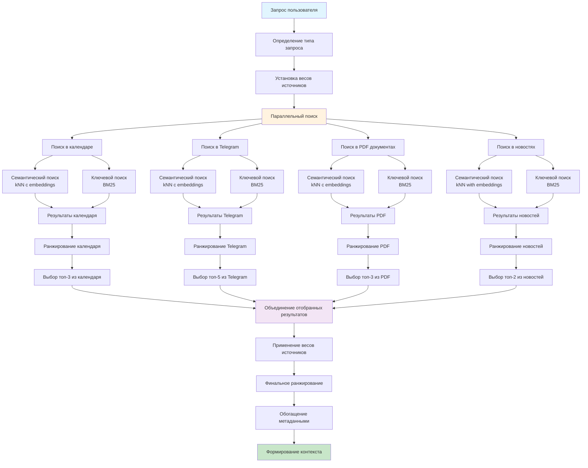
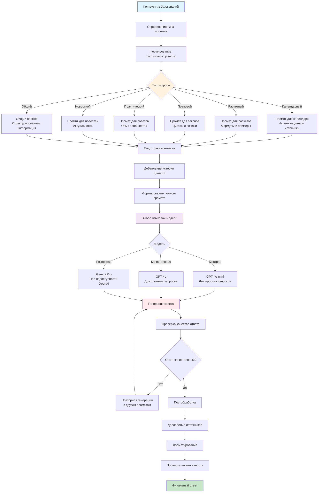
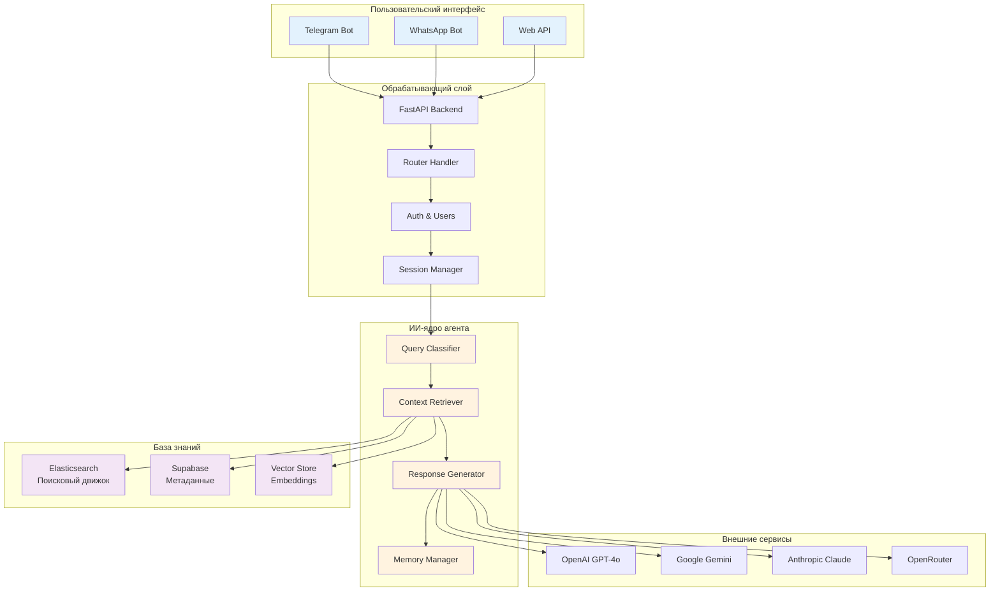
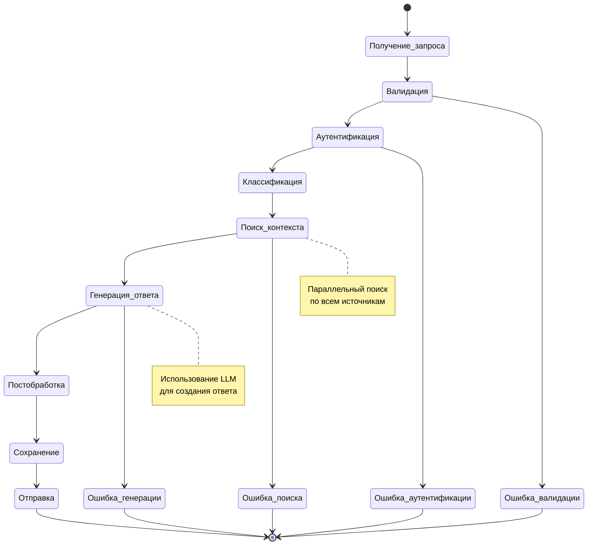
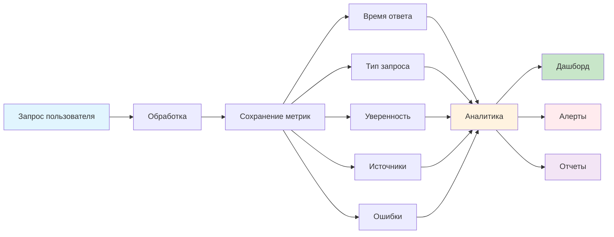

# TuExpertoFiscal NAIL: Mermaid диаграмма процесса работы агента

## 🔄 Полный флоу процесса

## 🎯 Детальный флоу поиска контекста

## 🧠 Процесс генерации ответа

## 📊 Архитектура системы

## 🔄 Жизненный цикл сессии

## 📈 Мониторинг и метрики

---

*Разработано NAIL - Nahornyi AI Lab*

YO
